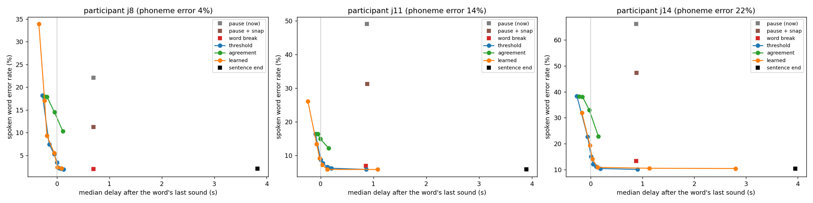

# Real-time read-back: speaking each word as it's decoded

**Question:** the published speech BCIs speak a sentence only after it's finished, because a large language model
rescores the whole sentence first. Can we get closer to real-time speech, one word at a time, without giving up
the accuracy that language knowledge buys?

**Short answer (simulated participants, details below):** yes. A decoder that combines the sound probabilities
with a word list and a small language model, and speaks a word as soon as it is ≥90% sure of it, was **as accurate
as waiting for the whole sentence**, and spoke each word a median of **~0.1 s** after its last sound. Waiting for the
sentence end took **~3–4 s**. About a third of words were spoken *before* the person had finished making them.

---

## 1. Why the BCIs wait (high-school version)

Picture the decoder hearing sounds one at a time: `S`, `AH`, `M`, ... When `S AH M` arrives, it could be "some",
"something", or (if one sound was misread) "sun". Later sounds settle it. A language model that sees the *whole*
sentence can use words on **both sides** ("i want ___ sweet" → "something"), so it fixes more mistakes. That's
why the BCI pipelines (Willett et al. 2023; Card et al. 2024) decode phonemes live, then rescore the finished
sentence with an n-gram model and an LLM before speaking it. That last step costs time: you hear nothing until the
sentence is done.

The opposite extreme skips words entirely: **synthesize the voice straight from the signal**. Wairagkar et al.
(Nature, 2025) did this with ~10 ms of decoding delay, and Littlejohn et al. (Nature Neuroscience, 2025) streamed speech in
80 ms steps. That's real time, but nothing corrects the errors, so whatever the decoder gets wrong is what you hear.

**Your idea sits in the middle:** use word and context knowledge, but speak a word *the moment it is certain
enough*, not when the sentence ends. That's a real research area under other names:

| Your idea | What it's called elsewhere |
|---|---|
| "turn phonemes into a word once it's likely enough" | the **uniqueness point** in the *cohort model* of human listening (Marslen-Wilson): people recognize a word as soon as only one word fits the sounds so far, often before it ends |
| "phoneme → token → word" | a **pronunciation prefix tree** (*trie*): each path of sounds is a word, and each node lists the words still possible |
| "knowledge of what was spoken before" | a **language model** conditioned on the words already spoken (here, a trigram) |
| "decide if it should be spoken" | a **READ/WRITE policy** in *simultaneous translation* (wait-k, monotonic attention), or the *LocalAgreement* rule that makes Whisper stream |
| "neural data + previous phoneme + previous token decide" | a **learned commit policy**: a small classifier that predicts "if I speak now, will it be right?" |

### Why not LLM tokens?

LLM tokens are pieces of **spelling** (`" water"`, `"ing"`), not pieces of **sound**. "though", "through" and
"tough" share letters but not sounds; "to", "too" and "two" share sounds but not tokens. So phonemes don't map
neatly onto tokens. Words do: each word has a pronunciation (a path in the tree) *and* a spelling (which an LLM can
score). That makes **the word** the meeting point:

```
signal → sounds (every 80 ms) → pronunciation tree → words → speech
                                       ↑
                    language model: P(next word | words already spoken)
                    (n-gram here; an LLM could supply this too, once per word)
```

And because the output is **speech**, spelling never matters: "to/too/two" are one entry. The decoder never has to
guess a spelling.

**The real cause of the delay is not the LLM itself.** It's the *right-hand context*: rescoring waits for words that
haven't been said yet. A language model that only looks left (at words already spoken) can run after every word,
LLM or not.

---

## 2. What was built

| File | Job |
|---|---|
| `english/pronunciations.txt` | 358 everyday words → ARPAbet (hand-written, CMU Pronouncing Dictionary style; 350 distinct sounds after merging homophones) |
| `english/corpus.txt` | 503 everyday sentences ("can you call the nurse", "i need my medicine"), split per sentence into LM / tuning / test |
| `lexicon.py` | the pronunciation tree, and a trigram language model with Kneser-Ney smoothing |
| `readback.py` | `WordBeamSearch`: streaming word decoder with irreversible commits; optional *continuous* mode (no pause between words) |
| `simulate.py` | can now perform real sentences (`--sentences`), with adjustable sloppiness (`--jitter`); it records when every sound started and ended |
| `ablations/realtime_readback.py` | experiment 1: commit policies, three participants |
| `ablations/readback_variants.py` | experiment 2: continuous typing and a personal language model |

### The decoder in one picture

Every 80 ms the phoneme network gives a probability for each sound. `WordBeamSearch` keeps the ~48 most likely
explanations ("hypotheses") of everything so far, e.g.

```
[i, need] + "S AH"      ← in the middle of "some"? "something"? "sun"?
[i, need] + "S"
[i, knee] + "S AH"
```

Adding up the hypotheses gives **P(next word = w)** for every word. When one word is likely enough, it's spoken,
and every hypothesis that disagrees is thrown away (speech can't be unsaid). The spoken words become the language
model's context for the next word.

Simplified, next to the real thing:

```python
# simplified                                         # readback.py (real)
for hyp in beam:                                     # step(): CTC prefix beam search; each hyp keeps
    for sound in sounds:                             #   P(ending in blank) and P(ending in a sound),
        node = tree.child(hyp.node, sound)           #   so "AH AH" (held) ≠ "AH _ AH" (said twice)
        if node: new.append(hyp + sound)             # LM "lookahead": the score includes the LM
    if tree.is_word(hyp.node):                       #   probability of all words still possible
        new.append(hyp.finish_word())                #   below the node, so likely words win early
beam = best(new, 48)

post = word_probabilities(beam)                      # posterior(): finished words count fully;
if post.max() >= 0.9:                                #   words in progress share their probability
    speak(post.argmax())                             #   among the words still possible
    beam = [h for h in beam if agrees(h)]            # commit(): drop disagreeing hyps
```

It runs in **~0.4 ms per 80 ms step** in plain Python, so it fits in real time with lots of room to spare.

### Commit policies compared

| Policy | Speaks word *k* when... |
|---|---|
| **pause (now)** | today's `live.py`: the pause after it is decoded. Sounds as decoded, no word list |
| **pause + snap** | same timing; the sounds are replaced by the nearest real word |
| **instant phonemes** | every sound is spoken the moment it's decoded (the "no words" extreme) |
| **word break** | word list + LM; the beam has seen the pause after the word |
| **threshold T** | P(word) ≥ T, even if the word isn't finished |
| **agreement N** | the same word has been the favourite for N steps in a row (Whisper's LocalAgreement idea) |
| **learned T** | a logistic regression on 12 features predicts P(correct if spoken now) ≥ T |
| **sentence end** | nothing until the sentence is over; then the single best sentence (stands in for LLM rescoring) |

The learned policy is the closest to your idea of neural data plus the previous phoneme and the previous token
deciding together. Its inputs: the word's probability and its lead over the runner-up, the entropy, how much of the
word's sound has arrived, how much of the beam has already seen the word break, the current blank and break
probabilities, whether a finger is on the pad right now (raw signal), the LM's prior for the word given the words
already spoken, the word's length, and the time since the last spoken word.

---

## 3. Results

### Setup

The participants are **simulated** (`simulate.py`, all 39 English sounds), because the real recordings use 10 sounds
and random prompts, so they contain no English words. Each simulated participant invents gestures, makes 2000 random
prompts to calibrate (as you do), and has a phoneme decoder trained on them with `train.py`. The decoder has **never
seen an English sentence**: all English knowledge comes from the word list and the language model. Each participant then
"says" 95 held-out test sentences three times each (1104 words). The LM never saw those sentences. Sloppiness was
set so the phoneme error rates bracket your real ones (14–27%): **4.5%, 14.3% and 21.5%**.

*Latency* = time a word is spoken minus the time the finger lifted from that word's last sound (negative = spoken
before the word was finished). *WER* = word error rate of what was **spoken** (it can't be taken back).



### Experiment 1: when to speak (`ablations/realtime_readback.py`)

Participant with **14% phoneme error** (closest to your recordings):

| Policy | Spoken WER | Median delay | 90th pct | Spoken before finished |
|---|---:|---:|---:|---:|
| pause (today's `live.py`) | 49.0% | +0.88 s | +0.96 s | 0% |
| pause + snap to nearest word | 31.2% | +0.88 s | +0.96 s | 0% |
| instant phonemes (per *sound*) | 20.0% PER | +0.04 s | +0.16 s | 27% |
| word break (word list + LM) | 6.9% | +0.86 s | +0.94 s | 0% |
| **threshold 0.9** | **6.5%** | **+0.12 s** | +1.11 s | 32% |
| threshold 0.95 | 6.2% | +0.15 s | +1.50 s | 27% |
| **learned 0.95** | **5.8%** | **+0.13 s** | +3.48 s | 31% |
| agreement 8 | 12.1% | +0.15 s | +0.70 s | 31% |
| sentence end (LLM-style wait) | 5.8% | +3.90 s | +7.24 s | 0% |

All three participants, at the setting that matches "sentence end" accuracy:

| Phoneme error | Sentence end | Threshold (setting) | Learned (setting) |
|---|---|---|---|
| 4.5% | 2.1% WER @ +3.82 s | 2.1% @ **+0.07 s** (0.98) | 2.2% @ +0.09 s (0.98) |
| 14.3% | 5.8% @ +3.90 s | 6.2% @ **+0.15 s** (0.95) | 5.8% @ **+0.13 s** (0.95) |
| 21.5% | 10.4% @ +3.95 s | 10.4% @ **+0.19 s** (0.98) | 10.9% @ +0.13 s (0.9) |

**What it shows**

1. **Waiting for the sentence end bought almost nothing here, and cost ~3.7 s per word.** At every noise
   level, a confidence threshold reaches the sentence-end accuracy (within ~0.4 points, about 4 words in 1104)
   while speaking each word ~0.1–0.2 s after its last sound. *Caveat:* the sentence-end decoder here uses the same
   trigram LM. An LLM rescorer understands long-range meaning, so it would recover more. The gap shown is the
   *minimum* price of streaming, not the maximum.
2. **Words, not sounds, are the big win.** The word list and LM cut the spoken error from 49% to ~6% at 14%
   phoneme error. Most of that comes from the word list ("pause + snap" alone gets 31%) plus context.
3. **The threshold sets the trade-off.** Lower thresholds speak sooner (even before the word ends) but make more
   errors. Around 0.9–0.95 is the knee. The 90th-percentile delay grows at high thresholds: a few words stay
   ambiguous ("go"/"going", "i"/"ice") until the pause or later.
4. **"Local agreement" (Whisper's rule) does poorly here.** At 80 ms steps the favourite word can stay the same
   for several steps while still wrong. Probability is a better signal than stability.
5. **The learned policy (your idea) is about as good as a plain threshold.** It's slightly better at 14% phoneme
   error (matches sentence-end accuracy at +0.13 s) and slightly worse elsewhere. Its weights show what it
   learned: almost everything comes from the beam's own confidence (P(top), margin over the runner-up, entropy),
   then the LM prior and how much of the word has been heard. **"Finger on the pad right now" (the raw signal) got
   ~zero weight**: the phoneme network already folds the signal into its probabilities. So the beam's probability is
   already well calibrated. A learned policy pays off once it gets information the beam *doesn't* have (see §5).

### Experiment 2: drop the pause, and know the person (`ablations/readback_variants.py`)

Same participant (14% phoneme error). *Continuous* = no pause between words at all: the lexicon and LM find the
word boundaries. *Personal LM* = the language model has seen this person's sentences before (people who use
communication devices repeat stock phrases a lot). It's a best case for familiar phrases.

| Typing | LM | Words/min | Threshold 0.9 | Threshold 0.98 | Sentence end |
|---|---|---:|---|---|---|
| pauses | corpus | 42.2 | 6.5% @ +0.12 s | 6.2% @ +0.21 s | 5.8% @ +3.90 s |
| pauses | personal | 42.2 | 5.1% @ **−0.36 s** | 2.0% @ **−0.28 s** | 1.8% @ +3.81 s |
| continuous | corpus | **57.7** | 26.0% @ −0.02 s | 12.7% @ +0.06 s | 10.7% @ +2.57 s |
| continuous | personal | **57.7** | 6.0% @ −0.33 s | **2.0% @ −0.21 s** | 1.8% @ +2.52 s |

1. **Dropping the pause is 37% faster to type** (42 → 58 words per minute) and still works. Boundaries come out of
   the word list + LM ("something", not "some thing"). With the general LM, errors roughly double (boundary
   mistakes). The phoneme decoder was never trained on continuous typing, so this is pessimistic.
2. **A personal LM makes most words come out *before they're finished*.** With pauses and threshold 0.98, the
   median word is spoken 0.28 s before its last sound, 66% of words are early, and **35% of all sounds never needed
   making**: the word was already spoken correctly before the finger started them. Accuracy matches the sentence-end
   wait (2.0% vs 1.8%).
3. **Together they're the fastest setup:** 58 words/min, 2.0% spoken WER, the median word spoken 0.21 s before
   it's finished.

### How early *could* words be spoken? (`ablations/uniqueness_point.py`)

Assume every sound is decoded perfectly. When does the true word first reach 90% probability?

| | before 1st sound | mid-word | right at its last sound | only after the pause | sounds saved |
|---|---:|---:|---:|---:|---:|
| word list only | 0% | 28% | 48% | 24% | 14% |
| word list + LM | 0% | 50% | 42% | 8% | 26% |
| personal LM | 1% | 71% | 25% | 2% | 44% |

The word list alone settles about a quarter of words before they end. Context doubles that. Only ~8% of words
truly need the pause (they're prefixes of other words: "go"/"going", "i"/"ice").

---

## 4. Takeaways

- **The delay in BCI speech comes from waiting for right-hand context, not from using an LLM.** A left-to-right
  decoder with a word list and an LM conditioned on the words already spoken can speak each word ~0.1–0.2 s after it's
  made, at (nearly) the accuracy of waiting for the sentence.
- **"phoneme → token → word" works best as phoneme → *word* (pronunciation tree) → speech.** LLM tokens are spelling,
  not sound. An LLM can still help as the "what comes next" model, asked once per word with the words already spoken.
- **Speak when P(word) ≥ ~0.9–0.95.** It's simple, calibrated and hard to beat. The learned policy matched it,
  and the raw signal added nothing beyond the beam's probabilities.
- **The biggest further gains come from better prediction (a personal or stronger LM) and dropping the pause.**
  Both change *when* a word becomes certain, which no commit rule can do.

## 5. Next steps (ideas, roughly in order)

1. **A pronunciation source for any word.** macOS's built-in text→phoneme converter is gone on this macOS version (see
   §6). Options: the CMU Pronouncing Dictionary (~3.6 MB) or `espeak-ng` (Homebrew). Either would let the lexicon
   grow from 358 words to a real vocabulary.
2. **Real data.** Once your sound inventory covers English, record prompts made of real sentences
   (`simulate.py --sentences` already performs them), and run `readback.py` on your own decoder's output.
3. **Plug it into live decoding.** `WordBeamSearch.step()` takes the same per-step probabilities `streaming.py`
   already computes. Show *tentative* words on screen (grey) and speak only committed ones, like streaming
   captions do (confirmed text + hypothesis text).
4. **Let the person stop early.** When a word is spoken before it's finished, the decoder should accept "moved on"
   and let the next word start (35–44% of sounds could be skipped with a personal LM). This needs a closed-loop
   simulation, where the simulated person reacts to what they hear.
5. **An LLM as the per-word predictor.** Score each word's spelling with a small local LLM, given the spoken words.
   One call per word with a cached prefix, and homophones summed. That would raise the "mid-word" share, which is
   what makes words early.
6. **A policy with information the beam lacks.** For example, the person's typing speed or per-sound error rates
   from recent use, or a "regret" signal (how often committed words get corrected), to tune the threshold per user.

## 6. The macOS pronunciation tool

`NSSpeechSynthesizer.phonemes(from:)` and the C function `CopyPhonemesFromText` both fail with error −50
(`paramErr`) on this macOS for **every one of the 184 installed voices**, including the classic MacinTalk voices
(Fred, Albert) that used to support it. `AVSpeechSynthesizer`'s phoneme markers come back empty too. Speech output
(`say`, `[[inpt PHON]]`) still works. Only the text→phonemes direction is gone, so it can't be fixed from our side.

## References

- Card et al. (2024), *An accurate and rapidly calibrating speech neuroprosthesis*, NEJM. Phoneme RNN + n-gram LM,
  then an LLM (OPT 6.7B) rescores the finished sentence. [paper](https://www.nejm.org/doi/full/10.1056/NEJMoa2314132),
  [code](https://github.com/Neuroprosthetics-Lab/nejm-brain-to-text)
- Wairagkar et al. (2025), *An instantaneous voice-synthesis neuroprosthesis*, Nature. Direct voice synthesis within
  ~10 ms. [paper](https://www.nature.com/articles/s41586-025-09127-3)
- Littlejohn et al. (2025), *A streaming brain-to-voice neuroprosthesis to restore naturalistic communication*,
  Nature Neuroscience. RNN-transducer, 80 ms steps. [paper](https://www.nature.com/articles/s41593-025-01905-6)
- Macháček et al. (2023), *Turning Whisper into Real-Time Transcription System* (LocalAgreement).
  [paper](https://www.afnlp.org/conferences/ijcnlp2023/proceedings/main-demo/cdrom/pdf/2023.ijcnlp-demo.3.pdf)
- Arivazhagan et al. (2019), *Monotonic Infinite Lookback Attention for Simultaneous Machine Translation*: learned
  read/write policies. [paper](https://arxiv.org/abs/1906.05218)
- Marslen-Wilson (1987), *Functional parallelism in spoken word-recognition*, Cognition: the cohort model and
  uniqueness points.

## Reproduce

```bash
.venv/bin/python ablations/realtime_readback.py prepare   # simulate 3 participants, train their decoders (~25 min)
.venv/bin/python ablations/realtime_readback.py analyze   # experiment 1 (~25 min) + the plot
.venv/bin/python ablations/readback_variants.py           # experiment 2 (~20 min)
.venv/bin/python ablations/uniqueness_point.py            # seconds
```
